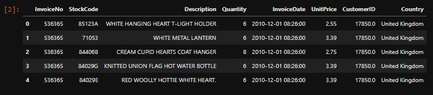
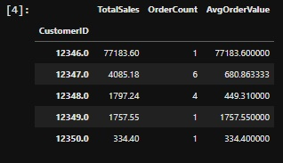
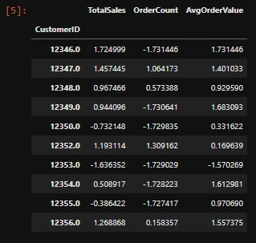
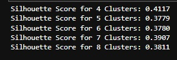
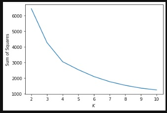
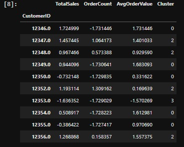
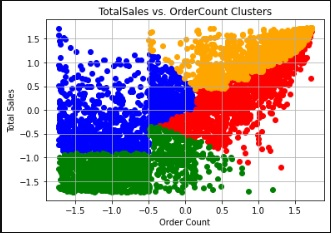
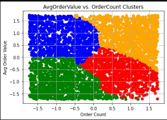
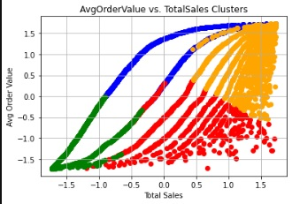
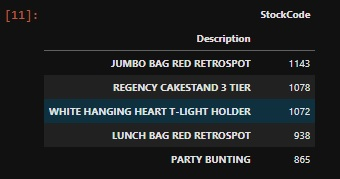

# K-means-clustering-for-customer-segmentation
Analyze customer purchasing behavior step by step

Customer segmentation allows businesses to divide their target markets into specific groups. This is important for optimizing marketing spend and effective reach. Dividing a market into segments enables a more customized message. This research will analyze the best market by consumer purchase behavior.  this time I will try to explain it step by step.

Each row contains 8 columns of data, and each row represents a purchased item. This isn't very useful yet, so let's clean and arrange this data so that we can get more actionable insights.

1. Data Cleansing: We will delete data that is no longer relevant, is missing, or may cause problems in the future.

2. Transform the data with the aggregation function to get more useful columns, so that each record represents a single customer's purchase history.

3. Normalize: Clustering algorithms like K-means are sensitive to the scales of the data used, so we’ll want to normalize the data.

Now, we're ready to begin cluster analysis. But first, we must decide how many clusters we will use. There are various methods for determining the number of clusters to use, but I'll focus on two in this article: (1) silhouette coefficient and (2) elbow technique.

4.  Silhouette: Cluster 4 had the highest silhouette coefficient, indicating 4 would be the best number of clusters. But we’re going to double-check that with the elbow method.

5. The Elbow Method: Based on the graph above, it looks like K=4, or 4 clusters is the optimal number of clusters for this analysis. Now let’s interpret the customer segments provided by these clusters.

6. let’s group the cluster metrics and see what we can gather from the normalized data for each cluster.

7.  Visualizing Clusters:

- Consumers in green have low overall revenues as well as a low order count, indicating that they are all-around low-value customers. Customers in orange, on the other hand, have both high total purchases and high order counts, indicating that they are the most valuable customers. 

- We're comparing the average order value to the total number of orders. Once again, the consumers in green have the lowest value, while the customers in orange have the highest value.
- There is another way to look at things. You might look at the consumers in the red cluster and try to discover methods to raise their order count by sending them email reminders or SMS push alerts based on other identifying variables. Perhaps you could send them an email with a discount if they return within 30 days. Even better, you may provide a delayed coupon (to be utilized within a particular time period) at checkout.
- Similarly, with blue segment clients, you could want to try some cross-selling and up-selling strategies at the cart. Perhaps a fast pop-up with a special offer based on market basket analysis (see the market basket analysis section below).

- The average order value vs total sales clusters are shown in this plot. This plot confirms the previous two plots by identifying the orange cluster as the highest value customers, the green cluster as the lowest value customers, and the blue and red clusters as high opportunity consumers.
- From a growth standpoint, I'd concentrate on the blue and red clusters. On-site, I'd try to better understand each cluster and their granular behaviors in order to decide which cluster to focus on first and inform the first few rounds of trials.

8. Find the best-selling item by segment
We know we have four groups and how much they spend each purchase, overall spending, and number of orders. The next step in better understanding the client segmentation is to discover which things are best-selling within each category.

Based on this data, we may conclude that the best-selling item in our highest-value cluster is the Jumbo Bag Red Retrospot. With such information, we may give suggestions to clients in this area about Other Items You Might Like. 

9. Recommendation
we went through a basic implementation of K-means clustering based on previous consumer purchase behaviour. This sort of study may be performed for nearly any organization that has the necessary data. Ecommerce businesses, SaaS businesses, service-based businesses, you name it. That being said, this is a simplified example, and without further testing and particular action, this information is meaningless. 
